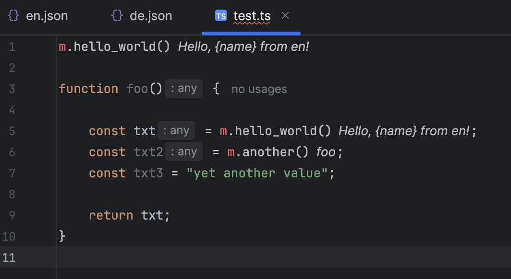

# Paraglide Translations plugin for Webstorm (beta)

Helps managing paraglide (inlang) translations in the Webstorm code editor.

[//]: # (![Build]&#40;https://github.com/TjenWellens/intellij-plugin-paraglide/workflows/Build/badge.svg&#41;)
[//]: # ([![Version]&#40;https://img.shields.io/jetbrains/plugin/v/33378.svg&#41;]&#40;https://plugins.jetbrains.com/plugin/33378&#41;)
[//]: # ([![Downloads]&#40;https://img.shields.io/jetbrains/plugin/d/33378.svg&#41;]&#40;https://plugins.jetbrains.com/plugin/33378&#41;)

## Getting started

1. install the plugin in webstorm
2. test if it works by opening the [dummy-project](./dummy-project) in webstorm
3. open test.ts

## Troubleshooting

if you don't see translations appear inline

1. close the code file (`test.ts`) and open it again
2. close webstorm entirely, open webstorm, close the code file (`test.ts`) and open it again

example with translations working (see cursive text next to lines with `m.xxx()`)

## Features, Limitations & Roadmap

features:

* show translation inline 

technical limitations: (because beta)

* poor performance: scans all json files every time a js/ts file opens, no caching yet
* files already open don't get translation inline (must reopen file to load)
* looks for `m.xxxx()` in js/ts files
* only scans for json files in folders `/translate` `./messages` `./translations`
* default locale hardcoded `en`

someday/maybe features:

* rename keys
* alt-enter move string to translations
* detect unused keys
* improved performance with caching
* read paraglide config file (s) to find json files
* read paraglide config file (s) to decide default locale, etc